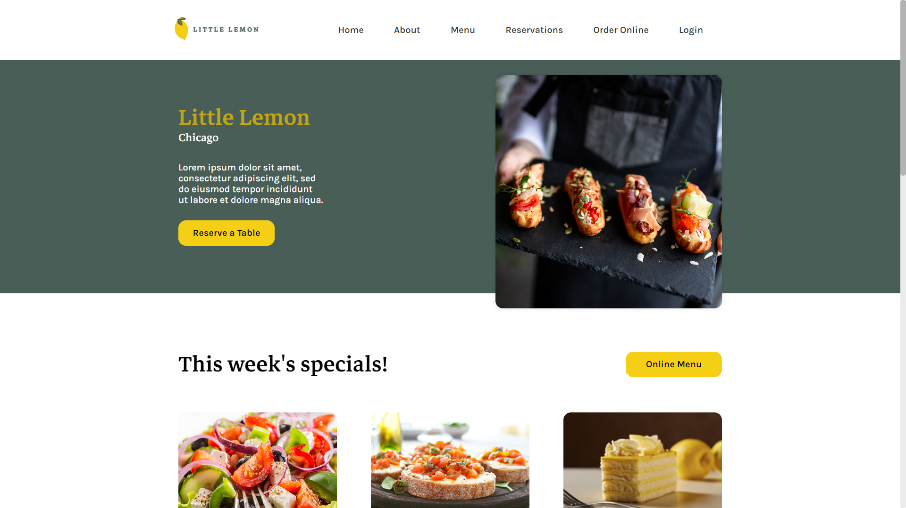
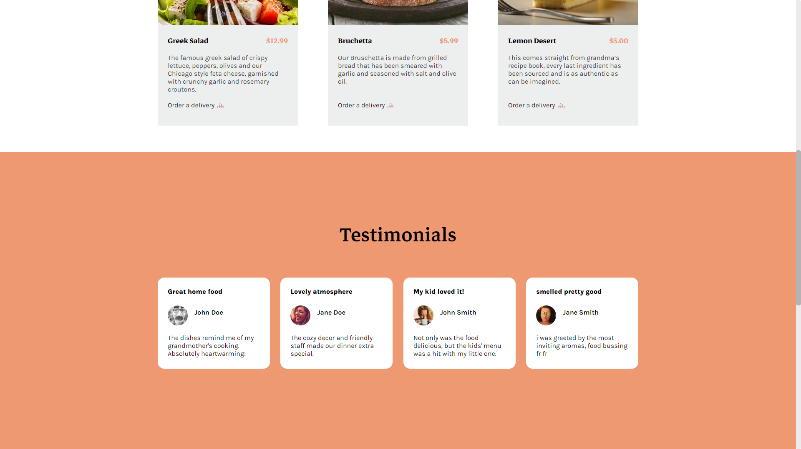
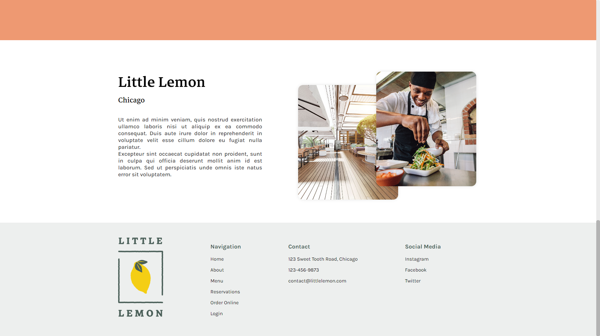
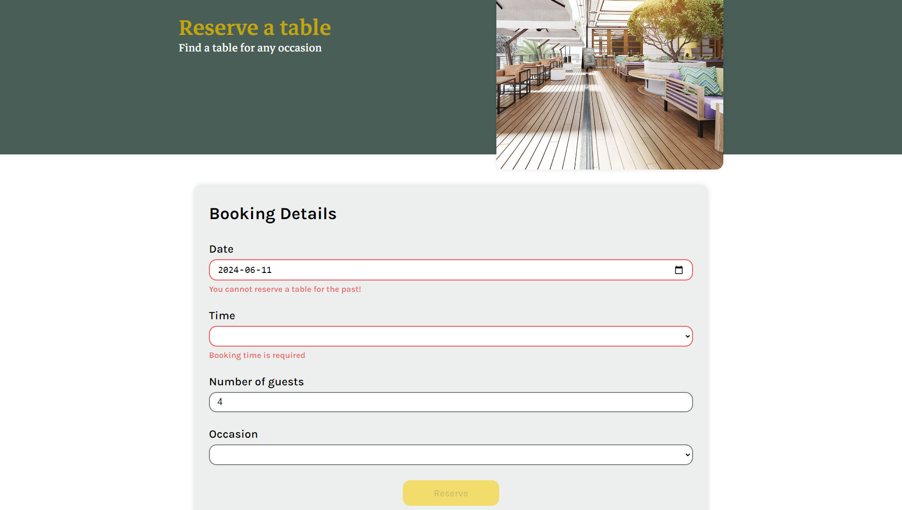
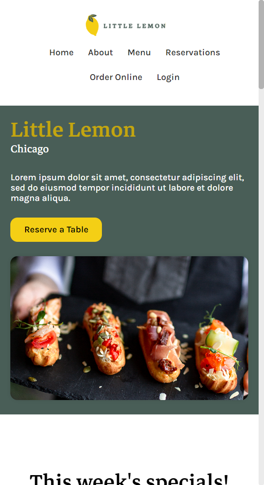
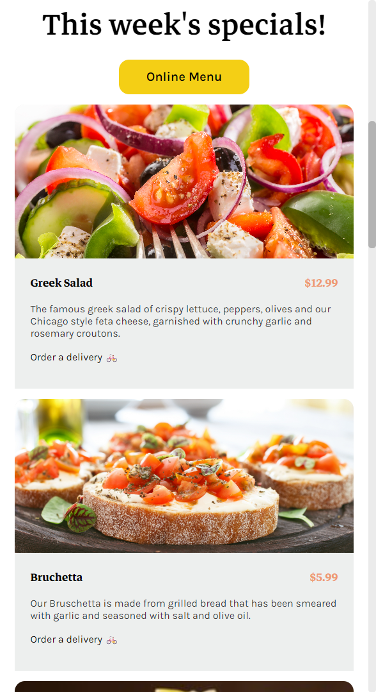
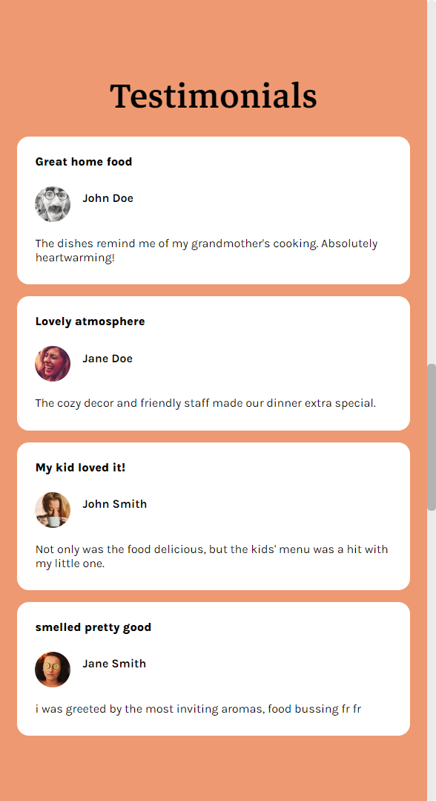
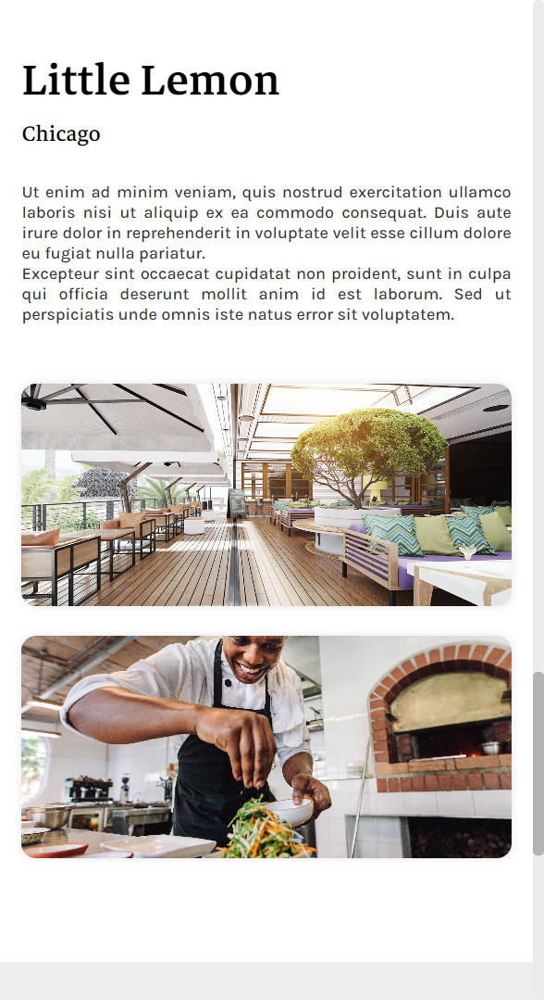

**npm run dev** to run  
On the Github Pages site, access reservations form through the homepage **Reserve a Table** button, not through navbar

# Capstone project website
Made for the Coursera Meta Front-End Developer specialization  
Not using create-react-app because it is deprecated - using Vite instead  
You can access the reservation form through the homepage link, but the navbar links don't work because my site uses React Router with different pages while Github pages uses different pages for hosting.  
Not sure why the homepage buttons work though (Reserve a Table and Menu)

# Very cool website that features:
- screen responsiveness with media queries and flexbox
- form validation with Formik and Yup
- unit testing with Jest
- separate pages with React Router
- props and state management
- React, JavaScript, HTML, CSS, React

# Gallery

